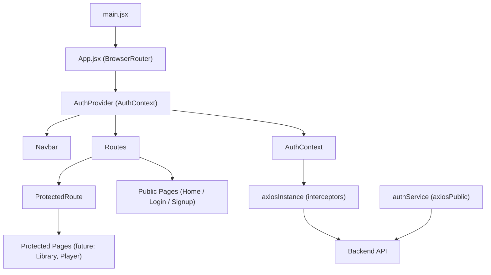
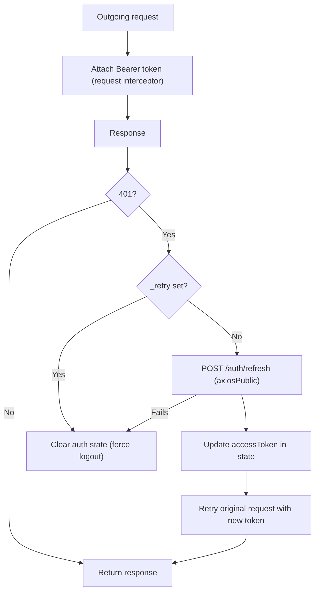

# System Patterns

## Architecture Overview



## Key Patterns

### 1. In-Memory Token Storage
- `accessToken` lives exclusively in React state inside `AuthContext`.
- A `useRef` (`accessTokenRef`) always mirrors the latest value so Axios interceptor callbacks (which close over the ref) never read stale tokens.
- Refresh token is managed entirely by the browser via the HttpOnly cookie — the frontend never touches it directly.

### 2. Axios Dual-Instance Pattern
| Instance | Purpose | Interceptors |
|----------|---------|--------------|
| `axiosInstance` (default export) | All authenticated API calls | Request: attach `Bearer` token. Response: 401 → refresh + retry |
| `axiosPublic` | Auth endpoints only (login, signup, logout, refresh) | None — prevents circular retry loops |

### 3. Silent Refresh Flow


### 4. Session Restoration on App Boot
`AuthProvider` runs a `useEffect` on mount that calls `refreshAccessToken()`. If the HttpOnly cookie is valid, the access token and user are restored silently. If not, the user stays unauthenticated. The `initializing` flag prevents `ProtectedRoute` from flashing a redirect before this check completes.

### 5. Protected Route Guard
`ProtectedRoute` uses React Router v6's `<Outlet>` pattern:
- While `initializing === true` → show spinner.
- If `!isAuthenticated` → `<Navigate to="/login" state={{ from: location }} replace />`.
- Otherwise → render `<Outlet />`.
- After login, the `Login` page reads `location.state.from` and redirects back to the original destination.

### 6. Admin Route Guard
`AdminRoute` ([`src/routes/AdminRoute.jsx`](../src/routes/AdminRoute.jsx)) extends the protected route pattern with role-checking:
- While `initializing === true` → show spinner (prevents flash of redirect).
- If `!isAuthenticated` → `<Navigate to="/login" state={{ from: location }} replace />`.
- If `isAuthenticated && !isAdmin` → `<Navigate to="/403" replace />`.
- Otherwise → render `<Outlet />`.

`isAdmin` is derived in [`src/context/AuthContext.jsx`](../src/context/AuthContext.jsx) as `!!accessToken && user?.role === "admin"`. The role comes from the backend via `normalizeAuth()` in [`src/services/authService.js`](../src/services/authService.js) — it is never set client-side.

### 6. CSS Modules
Every component owns its styles via a co-located `.module.css` file. Global tokens (colours, fonts, radius) are defined as CSS custom properties in `src/index.css`.

## Folder Structure
```
src/
  context/        AuthContext.jsx  PlayerContext.jsx
  hooks/          useAuth.js
  services/       axiosInstance.js  authService.js  playlistService.js  songService.js
  routes/         ProtectedRoute.jsx  PublicOnlyRoute.jsx  AdminRoute.jsx
  components/
    Navbar/            Navbar.jsx  Navbar.module.css
    AuthForm/          AuthForm.module.css  (shared by Login & Signup)
    MusicPlayer/       MusicPlayer.jsx  MusicPlayer.module.css  QueuePanel.jsx  QueuePanel.module.css
    PlaylistSidebar/   PlaylistSidebar.jsx  PlaylistSidebar.module.css
  pages/
    Home/              Home.jsx  Home.module.css
    Login/             Login.jsx
    Signup/            Signup.jsx
    NotFound/          NotFound.jsx  NotFound.module.css  (supports variant="forbidden" for 403)
    AdminDashboard/    AdminDashboard.jsx  AdminDashboard.module.css
    Artists/           Artists.jsx  Artists.module.css  (admin-only, /admin/artists)
  App.jsx
  main.jsx
  index.css